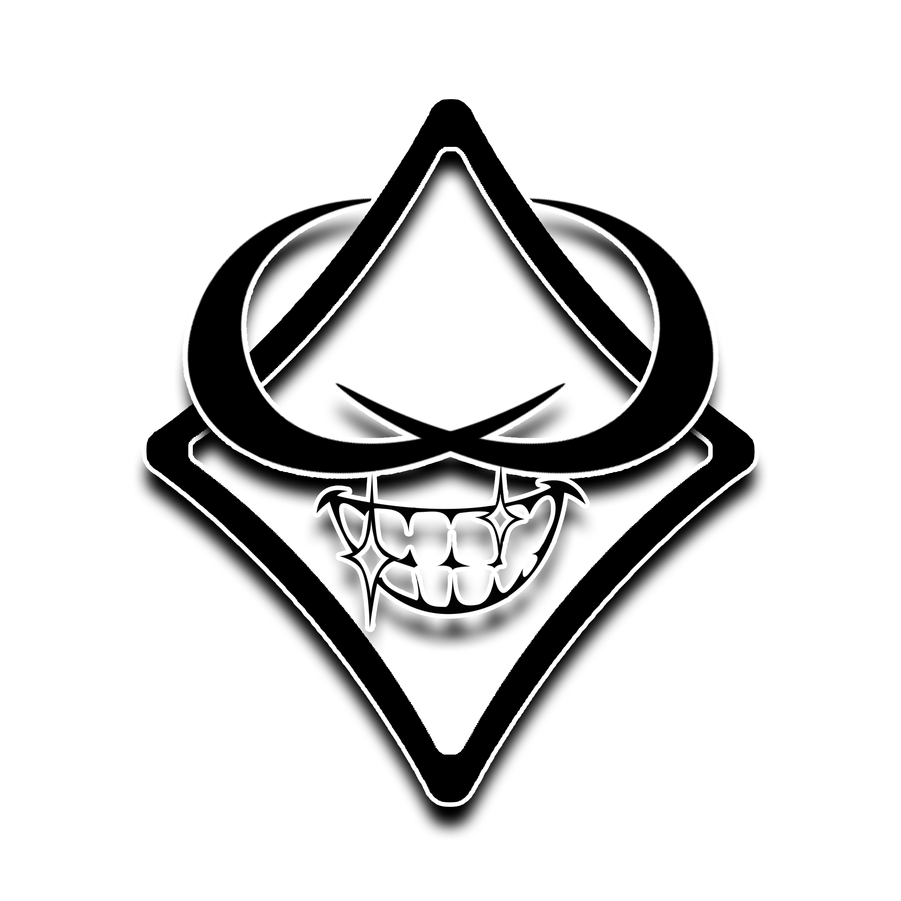

# ANTEPROYECTO

 

| Autor                          | Juan José Flores Gassín                      |
|--------------------------------|---------------------------------------------|
| Centro educativo               | [I.E.S. Francisco Romero Vargas (Jerez de la Frontera)](https://sites.google.com/iesromerovargas.com/romerovargas/inicio) |
| Grado Superior                 | Desarrollo de Aplicaciones Web               |
| Curso                          | 2023/2024                                    |

## Índice
1. [Introducción](#introducción)
2. [Finalidad](#finalidad)
3. [Objetivos](#objetivos)
4. [Medios necesarios](#medios-necesarios)
5. [Planificación](#planificación)

## Introducción
En este anteproyecto se explicará detalladamente todo en lo que se va basar la web que crearé. Como bien dice el título de la portada del documento, mi proyecto se llama **Gass Ink Tattoo**.

Esta web va enfocada a las personas que les gusta el mundo de los tatuajes, ya que es una web de un futuro estudio de tatuaje. Podrás ver todo tipo de tatuajes en ella, además de poder concertar citas con los tatuadores para tu sesión, donde el tatuaje podrá ser de la misma web, creado desde cero a partir de una idea que se le dará al tatuador o tuyo personalizado. Además de lo ya mencionado, en esta web se podrá comprar productos relacionados con la marca del estudio o para el mantenimiento de tus tatuajes. No entraré en más detalles, porque en los siguientes apartados hablaré en profundidad de cada tema.

## Finalidad
Este proyecto estará enfocado en conseguir una web que sea muy intuitiva de manera que todo el mundo pueda navegar con facilidad por ella.

Por otro lado, quiero que el estudio de tatuaje tenga todo bien organizado en su web, así los trabajadores puedan tener todas sus sesiones, con sus respectivos clientes, ordenadas de manera sencilla.

En la siguiente enumeración voy a recalcar algunos de los puntos más importantes del proyecto:

- **Variedad de diseños:** Tendremos muchísima cantidad de modelos de tatuajes todos ordenados por diferentes tipos para que el cliente pueda encontrar rápidamente lo más semejante a su gusto.
- **Citas para sesiones de tatuaje:** Se podrá enviar a los tatuadores peticiones para coger cita, de esta forma poder dejar todo confirmado y aceptado por ambas partes, al concertar la cita se le indicará al cliente los datos de esta misma.
- **Apartado de merchardising y productos para tatuajes:** Además de poder concertar tus citas como bien dije en el apartado anterior, se podrá comprar productos para tus tatuajes y merchardising del estudio, añádiendolos a tu carrito y pasando por sistema de pago web, recibiendo tu respectiva factura. 

La conclusión a la que quiero llegar es que el estudio de tatuajes tenga una web muy útil para facilitar la distribución del trabajo y la satisfacción de los clientes.

## Objetivos
### Búsqueda con múltiples filtros
Podrá buscar sus tatuajes por tipos, además de poder ordenarlos según el criterio que elija, como podría ser el precio o la fecha de creación.

### Sistema de citas
Los clientes podrán solicitar su sesión a través de la web con un diseño seleccionado de ella o uno propio, en este último caso, el tatuador verificará primero el diseño para luego aceptar e informarle sobre el precio al cliente.

### Gestión desde el apartado del trabajador
El trabajador podrá iniciar sesión en la web para poder acceder a sus datos personales, entre ellos estarán sus últimos trabajos realizados, aparte de ver las citas próximas que tiene pendiente, y también las solicitudes de diseños personalizados de los clientes.

### Perfil de usuarios
Dentro de cada perfil de usuario tendrá un apartado con sus sesiones realizadas y las que tenga pendientes, diseños marcados como favoritos, además de su carrito de productos del estudio.

### Diseño intuitivo y llamativo
Buscaré el equilibrio de manera que sea lo más intuitivo para todo tipo de clientes pero sin perder el diseño ambientativo que debe llevar una web dedicada al mundo del tatuaje.

## Medios necesarios
En este apartado hablaré sobre el hardware y software que utilizaré para desarrollar el proyecto:

### Hardware
- **Ordenador personal**, el cual tiene suficiente capacidad para desarrollar todo el proyecto sin ningún problema.

### Software
- **Entorno de desarrollo:** utilizaré Visual Studio Code, ya que para mi gusto es en el que más he desarrollado, además de tener todo configurado a mis necesidades.
- **Frameworks**: para el tema de front-end usaré React y para el lado del back-end usaré un framework dedicado a esta parte de la web, como podría ser Symfony, Express, etc
- **Elementos gráficos:** estos serán previamente editados en Adobe Photoshop CC 19.
- **Base de datos:** para el almacenamiento de los usuarios, trabajadores, diseños, etc.
- **Aspecto de la web:** además de estilos con CSS, añadiré Bootstrap para mejorar el diseño de la web donde sea necesario.

## Planificación

### Comienzo del proyecto (5h)

- Creación del proyecto.
- Creación de la base de datos.
- Organización de la estructura de la web.

### Creación de funcionalidades de la navegación de la página (13h)

- Barra de navegación de la página.
- Apartado de productos y merchandising.
- Apartado de diseños.
- Buscador con filtros.

### Creación de funcionalidades principales - Trabajador (14h)

- Login para los trabajadores.
- Interfaz para los trabajadores.
- Visualizador de los diseños propios del trabajador.
- Manejo de citas.
- Visualizador de citas pendientes

### Creación de funcionalidades principales - Cliente (14h)

- Sistema de registro de clientes.
- Login para los clientes.
- Interfaz de usuario.
- Funcionalidad para poder marcar artículos como favoritos.
- Creación de carrito.
- Sistema de pedir citas.
- Funcionalidad para solicitar cita o pagar el carrito, generador de factura.

### Retoques del apartado visual y búsqueda de errores (5h)

- Integración de Bootstrap para mejorar la apariencia y la usabilidad.
- Desarrollo de estilos adicionales para mejorar la experiencia visual del usuario.
- Comprobar al máximo la funcionalidad de la web intentando corregir todos los errores detectables.

### Tiempo total estimado - 51h